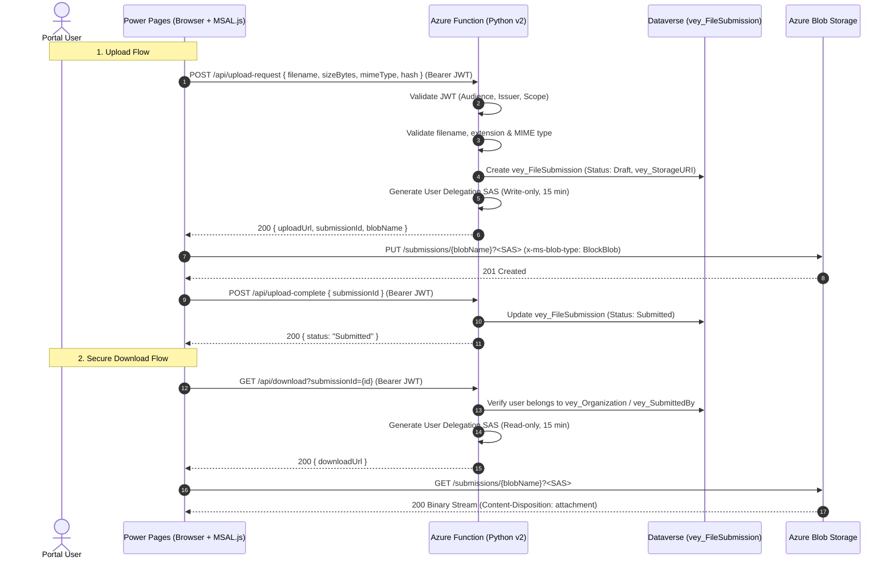
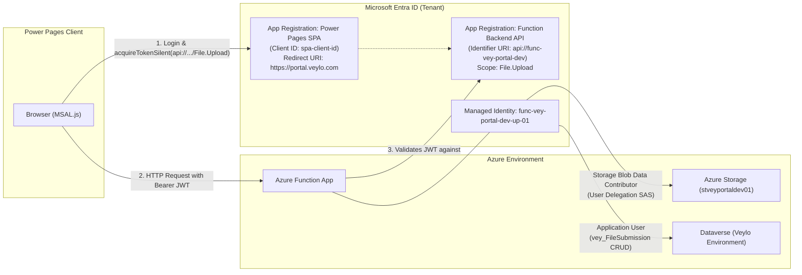

# Azure Function App — File Upload to Azure Storage

## Overview

Add a serverless Azure Function app (HTTP-triggered) in Python that coordinates secure file uploads and downloads between the Veylo Power Pages portal, Azure Blob Storage, and Dataverse.

To eliminate serverless memory exhaustion and request timeout limits on large files (up to 50 MB), this architecture uses the **Direct-to-Storage (Pre-Signed SAS)** pattern:
1. Power Pages authenticates the user via Microsoft Entra ID (MSAL.js) and requests an upload ticket.
2. The Azure Function validates the token, verifies file metadata, creates a draft `vey_FileSubmission` record in Dataverse, and issues a short-lived, write-only **User Delegation SAS token** via Managed Identity.
3. The browser uploads the binary payload directly to Azure Blob Storage.
4. The browser notifies the Function to mark the submission as `Submitted`, kicking off asynchronous ingestion/processing.
5. Authorized users download files using short-lived read SAS URLs generated on demand.

---

## Architecture

### Upload & Download Sequence



---

## Entra ID / App Registration Architecture

To secure communication between the Power Pages client and the Azure Function without exposing secrets, two Entra ID App Registrations and one Managed Identity are used:



### 1. Backend API App Registration (`app-vey-upload-api-<env>`)
* **Role**: Represents the Azure Function HTTP API as a protected resource.
* **Application ID URI**: `api://func-vey-portal-<env>`
* **Exposed Scopes**:
  * Name: `File.Upload`
  * Admin / User consent display name: `Upload files to Veylo`
  * Description: `Allows authenticated portal users to request upload tickets and download files.`
* **Authorized Client Applications**: Pre-authorizes the Frontend SPA Client ID to suppress interactive consent prompts for portal users.

### 2. Frontend SPA App Registration (`app-vey-portal-spa-<env>`)
* **Role**: Used by MSAL.js in the Power Pages portal to obtain OAuth tokens via PKCE.
* **Platform Configuration**: Single-Page Application (SPA).
* **Redirect URIs**:
  * Dev: `https://<dev-portal-subdomain>.powerappsportals.com`
  * Local Dev: `http://localhost:3000` (for local portal mockup/testing)
  * Prod: `https://portal.veylo.com`
* **API Permissions**: Delegated permission to `api://func-vey-portal-<env>/File.Upload`.

### 3. Function App System-Assigned Managed Identity
* **Storage Account Role**: `Storage Blob Data Contributor` assigned on `stveyportal<env>01`.
  * Enables generating **User Delegation Keys** (`blob_service_client.get_user_delegation_key()`) to sign short-lived SAS URLs without storage account access keys.
* **Dataverse Application User**:
  * Created in Power Platform Admin Center using the Function's Managed Identity (or Enterprise Application object ID).
  * Assigned a security role granting `Create`, `Read`, and `Update` privileges on `vey_FileSubmission`.

---

## Decision Log

| # | Decision | Choice | Rationale |
|---|---|---|---|
| 1 | **Runtime** | **Python 3.11 (v2 programming model)** | Decorator syntax (`@app.route`), clean dependency isolation, matches team skillset. |
| 2 | **Hosting Plan** | **Linux Consumption (`Y1`)** | Serverless cost model, auto-scaling for variable portal submission bursts. |
| 3 | **Upload Strategy** | **Direct-to-Storage via Write-Only SAS** | Prevents Function RAM exhaustion (OOM), eliminates 50MB HTTP timeouts, offloads binary transport to Azure Storage fabric. |
| 4 | **Client Auth** | **Entra ID App Registration + MSAL.js** | Browser acquires Bearer JWT with `api://func-vey-portal-<env>/File.Upload` scope using MSAL.js; Function validates JWT signature & claims. |
| 5 | **Dataverse Link** | **`vey_FileSubmission` Entity** | Matches pre-existing Dataverse solution table; tracks `vey_StorageURI`, `vey_FileHash`, `vey_FileSizeBytes`, `vey_SubmissionStatus`, and submitter relations. |
| 6 | **Storage Access & Keys** | **Managed Identity (User Delegation SAS)** | Zero static connection strings or account keys stored in configuration. Short-lived SAS (15 min) for both uploads and downloads. |
| 7 | **Download Strategy** | **User Delegation Read SAS via Function API** | Container is completely private; Function verifies user/organization authorization before granting temporary read SAS. |
| 8 | **IaC Tool** | **Terraform (`azurerm`, `azuread`)** | Declarative configuration covering Azure Storage, Function App, App Insights, RBAC, and Entra ID App Registrations. |
| 9 | **Naming Standard** | **`vey` CAF Pattern** | Consistent prefix matching Dataverse solution prefix `vey_`. |

---

## Environment Separation & Resource Naming

Pattern: `<type>-vey-<app>-<env>-<unit>-<seq>`

| Resource | CAF Pattern | Dev Example | Notes |
|---|---|---|---|
| **Resource Group** | `rg-vey-<app>-<env>-01` | `rg-vey-portal-dev-01` | Dedicated per environment |
| **App Service Plan** | `plan-vey-<app>-<env>-01` | `plan-vey-portal-dev-01` | Linux Consumption (`Y1`) |
| **Function App** | `func-vey-<app>-<env>-<unit>-01` | `func-vey-portal-dev-up-01` | Hosts upload/download API endpoints |
| **Storage Account** | `stvey<app><env><seq>` | `stveyportaldev01` | Max 24 chars, lowercase alphanumeric |
| **Storage Container** | `submissions` | `submissions` | Clean, non-redundant private container |
| **Application Insights** | `appi-vey-<app>-<env>-01` | `appi-vey-portal-dev-01` | Telemetry & request logging |
| **Log Analytics** | `log-vey-<app>-<env>-01` | `log-vey-portal-dev-01` | Central workspace for App Insights |
| **Backend App Registration** | `app-vey-<app>-api-<env>` | `app-vey-portal-api-dev` | Exposes `File.Upload` API scope |
| **Frontend SPA Registration** | `app-vey-<app>-spa-<env>` | `app-vey-portal-spa-dev` | Power Pages MSAL.js SPA registration |

---

## Proposed Folder Structure

```text
src/
└── func-file-upload/
    ├── host.json
    ├── requirements.txt           # azure-functions, azure-storage-blob, azure-identity, PyJWT, requests
    ├── function_app.py            # HTTP endpoints: /upload-request, /upload-complete, /download
    ├── services/
    │   ├── __init__.py
    │   ├── auth_service.py        # Entra ID token verification (signature, aud, iss, exp)
    │   ├── dataverse_service.py   # Dataverse Web API client (vey_FileSubmission CRUD)
    │   └── storage_service.py     # User Delegation SAS generation
    ├── infra/
    │   ├── main.tf                # Function App, Storage, App Insights, Log Analytics, RBAC
    │   ├── entra.tf               # Backend API & Frontend SPA App Registrations
    │   ├── variables.tf           # Environment parameters
    │   ├── outputs.tf             # Endpoint URLs, App IDs, Storage account name
    │   ├── locals.tf              # Standardized CAF naming calculations
    │   └── environments/
    │       ├── dev.tfvars.example
    │       ├── ppd.tfvars.example
    │       └── prd.tfvars.example
    ├── .funcignore
    └── local.settings.json.example
```

---

## Implementation Details

### 1. Infrastructure Declaration (`infra/main.tf` & `infra/entra.tf`)

Key resource definitions:
* **Storage Account**:
  * `account_tier = "Standard"`, `account_replication_type = "LRS"` (or `GRS` in prod).
  * `public_network_access_enabled = true` with `allow_nested_items_to_be_public = false`.
  * `min_tls_version = "TLS1_2"`, `https_traffic_only_enabled = true`.
  * Storage CORS: Allowed origins `[var.powerpages_origin]`, allowed methods `["PUT", "GET", "HEAD", "OPTIONS"]`, allowed headers `["*"]`, exposed headers `["*"]`.
* **Private Container**:
  * Name: `submissions`, `container_access_type = "private"`.
* **Function App**:
  * `azurerm_linux_function_app` with `identity { type = "SystemAssigned" }`.
  * Site Config: CORS allowed origins `[var.powerpages_origin]`, `support_credentials = true`.
  * App Settings: `STORAGE_ACCOUNT_NAME`, `BLOB_CONTAINER_NAME = "submissions"`, `DATAVERSE_URL`, `ENTRA_TENANT_ID`, `API_AUDIENCE`.
* **RBAC Role Assignment**:
  * Role: `Storage Blob Data Contributor` assigned to the Function App's principal ID on the storage account scope.
* **App Insights & Log Analytics**:
  * Connect `azurerm_log_analytics_workspace` to `azurerm_application_insights`, linked to Function via `APPLICATIONINSIGHTS_CONNECTION_STRING`.

---

### 2. Dependencies (`requirements.txt`)

```text
azure-functions>=1.18.0
azure-storage-blob>=12.19.0
azure-identity>=1.15.0
PyJWT[crypto]>=2.8.0
requests>=2.31.0
```

---

### 3. Azure Function Implementation (`function_app.py`)

```python
import datetime
import json
import logging
import os
import re
import uuid
import azure.functions as func
from azure.identity import DefaultAzureCredential
from azure.storage.blob import (
    BlobServiceClient,
    BlobSasPermissions,
    generate_blob_sas,
    ContentSettings
)
from services.auth_service import validate_jwt_token
from services.dataverse_service import DataverseClient

app = func.FunctionApp(http_auth_level=func.AuthLevel.ANONYMOUS)

STORAGE_ACCOUNT_NAME = os.environ.get("STORAGE_ACCOUNT_NAME")
CONTAINER_NAME = os.environ.get("BLOB_CONTAINER_NAME", "submissions")
MAX_FILE_SIZE_BYTES = 50 * 1024 * 1024  # 50 MB
ALLOWED_EXTENSIONS = {".pdf", ".docx", ".xlsx", ".csv", ".png", ".jpg", ".jpeg"}
ALLOWED_MIME_TYPES = {
    "application/pdf",
    "application/vnd.openxmlformats-officedocument.wordprocessingml.document",
    "application/vnd.openxmlformats-officedocument.spreadsheetml.sheet",
    "text/csv",
    "image/png",
    "image/jpeg"
}

credential = DefaultAzureCredential()
blob_service_client = BlobServiceClient(
    account_url=f"https://{STORAGE_ACCOUNT_NAME}.blob.core.windows.net",
    credential=credential
)
dataverse_client = DataverseClient()

def sanitize_filename(filename: str) -> str:
    base = os.path.basename(filename.replace("\\", "/"))
    clean = re.sub(r'[^a-zA-Z0-9_.-]', '_', base)
    return clean or "upload.bin"

# ---------------------------------------------------------------------------
# Endpoint 1: Request Upload Ticket (Generates Write SAS & Draft Record)
# ---------------------------------------------------------------------------
@app.route(route="upload-request", methods=["POST"])
def request_upload(req: func.HttpRequest) -> func.HttpResponse:
    logging.info("Processing upload ticket request.")

    # 1. Authenticate Entra ID Bearer Token
    user_claims = validate_jwt_token(req.headers.get("Authorization"))
    if not user_claims:
        return func.HttpResponse("Unauthorized", status_code=401)

    try:
        data = req.get_json()
        filename = data.get("filename", "")
        file_size = int(data.get("fileSizeBytes", 0))
        mime_type = data.get("mimeType", "")
        file_hash = data.get("fileHash", "")
        organization_id = data.get("organizationId")

        # 2. Validate Metadata
        _, ext = os.path.splitext(filename)
        if ext.lower() not in ALLOWED_EXTENSIONS or mime_type not in ALLOWED_MIME_TYPES:
            return func.HttpResponse("Unsupported file extension or MIME type.", status_code=400)

        if file_size <= 0 or file_size > MAX_FILE_SIZE_BYTES:
            return func.HttpResponse(f"File size must be between 1 byte and {MAX_FILE_SIZE_BYTES} bytes.", status_code=400)

        safe_filename = sanitize_filename(filename)
        submission_id = str(uuid.uuid4())
        blob_name = f"raw/{submission_id}/{safe_filename}"

        # 3. Create Draft Record in Dataverse (vey_FileSubmission)
        blob_url = f"https://{STORAGE_ACCOUNT_NAME}.blob.core.windows.net/{CONTAINER_NAME}/{blob_name}"
        dataverse_client.create_file_submission(
            submission_id=submission_id,
            filename=safe_filename,
            file_size=file_size,
            file_hash=file_hash,
            storage_uri=blob_url,
            organization_id=organization_id,
            submitted_by_contact_id=user_claims.get("contact_id")
        )

        # 4. Generate User Delegation SAS (Write-only, 15 min TTL)
        now = datetime.datetime.now(datetime.timezone.utc)
        user_delegation_key = blob_service_client.get_user_delegation_key(
            key_start_time=now - datetime.timedelta(minutes=5),
            key_expiry_time=now + datetime.timedelta(minutes=20)
        )

        sas_token = generate_blob_sas(
            account_name=STORAGE_ACCOUNT_NAME,
            container_name=CONTAINER_NAME,
            blob_name=blob_name,
            user_delegation_key=user_delegation_key,
            permission=BlobSasPermissions(write=True, create=True),
            expiry=now + datetime.timedelta(minutes=15)
        )

        upload_url = f"{blob_url}?{sas_token}"

        return func.HttpResponse(
            body=json.dumps({
                "submissionId": submission_id,
                "blobName": blob_name,
                "uploadUrl": upload_url
            }),
            mimetype="application/json",
            status_code=200
        )
    except Exception as ex:
        logging.exception("Failed to generate upload ticket.")
        return func.HttpResponse(json.dumps({"error": "Internal server error"}), mimetype="application/json", status_code=500)

# ---------------------------------------------------------------------------
# Endpoint 2: Complete Upload (Transitions vey_FileSubmission to 'Submitted')
# ---------------------------------------------------------------------------
@app.route(route="upload-complete", methods=["POST"])
def complete_upload(req: func.HttpRequest) -> func.HttpResponse:
    user_claims = validate_jwt_token(req.headers.get("Authorization"))
    if not user_claims:
        return func.HttpResponse("Unauthorized", status_code=401)

    try:
        data = req.get_json()
        submission_id = data.get("submissionId")
        if not submission_id:
            return func.HttpResponse("submissionId is required", status_code=400)

        # Mark Dataverse record as Submitted
        dataverse_client.update_submission_status(submission_id, status="Submitted")
        return func.HttpResponse(json.dumps({"status": "Submitted"}), mimetype="application/json", status_code=200)
    except Exception:
        logging.exception("Failed to complete upload.")
        return func.HttpResponse(json.dumps({"error": "Internal server error"}), mimetype="application/json", status_code=500)

# ---------------------------------------------------------------------------
# Endpoint 3: Secure Download (Generates Read-only SAS for Authorized Users)
# ---------------------------------------------------------------------------
@app.route(route="download", methods=["GET"])
def download_file(req: func.HttpRequest) -> func.HttpResponse:
    user_claims = validate_jwt_token(req.headers.get("Authorization"))
    if not user_claims:
        return func.HttpResponse("Unauthorized", status_code=401)

    submission_id = req.params.get("submissionId")
    if not submission_id:
        return func.HttpResponse("submissionId query parameter required", status_code=400)

    # Verify authorization against Dataverse
    submission = dataverse_client.get_file_submission(submission_id)
    if not submission or not dataverse_client.is_user_authorized_for_submission(user_claims, submission):
        return func.HttpResponse("Forbidden", status_code=403)

    blob_name = submission["blob_name"]
    now = datetime.datetime.now(datetime.timezone.utc)
    user_delegation_key = blob_service_client.get_user_delegation_key(
        key_start_time=now - datetime.timedelta(minutes=5),
        key_expiry_time=now + datetime.timedelta(minutes=20)
    )

    sas_token = generate_blob_sas(
        account_name=STORAGE_ACCOUNT_NAME,
        container_name=CONTAINER_NAME,
        blob_name=blob_name,
        user_delegation_key=user_delegation_key,
        permission=BlobSasPermissions(read=True),
        expiry=now + datetime.timedelta(minutes=15),
        content_disposition=f'attachment; filename="{submission["filename"]}"'
    )

    download_url = f"https://{STORAGE_ACCOUNT_NAME}.blob.core.windows.net/{CONTAINER_NAME}/{blob_name}?{sas_token}"
    return func.HttpResponse(json.dumps({"downloadUrl": download_url}), mimetype="application/json", status_code=200)
```

---

### 4. Power Pages Client Integration (`MSAL.js` + Direct PUT)

In the portal's custom JavaScript:

```javascript
// Initialize MSAL client
const msalConfig = {
  auth: {
    clientId: "<SPA_CLIENT_ID>",
    authority: "https://login.microsoftonline.com/<TENANT_ID>",
    redirectUri: window.location.origin,
  },
  cache: { cacheLocation: "sessionStorage" }
};
const msalInstance = new msal.PublicClientApplication(msalConfig);

async function getAccessToken() {
  const account = msalInstance.getAllAccounts()[0];
  const tokenRequest = {
    scopes: ["api://func-vey-portal-dev/File.Upload"],
    account: account
  };
  try {
    const res = await msalInstance.acquireTokenSilent(tokenRequest);
    return res.accessToken;
  } catch (err) {
    const res = await msalInstance.acquireTokenPopup(tokenRequest);
    return res.accessToken;
  }
}

async function uploadFileToVeylo(file, organizationId) {
  const token = await getAccessToken();

  // 1. Request upload ticket from Function
  const ticketRes = await fetch(`${FUNC_BASE_URL}/api/upload-request`, {
    method: "POST",
    headers: {
      "Content-Type": "application/json",
      "Authorization": `Bearer ${token}`
    },
    body: JSON.stringify({
      filename: file.name,
      fileSizeBytes: file.size,
      mimeType: file.type,
      organizationId: organizationId
    })
  });
  if (!ticketRes.ok) throw new Error("Failed to obtain upload ticket");
  const { uploadUrl, submissionId } = await ticketRes.json();

  // 2. Direct binary PUT to Azure Blob Storage (bypassing Function worker memory)
  const blobUploadRes = await fetch(uploadUrl, {
    method: "PUT",
    headers: {
      "x-ms-blob-type": "BlockBlob",
      "Content-Type": file.type
    },
    body: file
  });
  if (!blobUploadRes.ok) throw new Error("Blob storage upload failed");

  // 3. Mark complete in Dataverse
  const completeRes = await fetch(`${FUNC_BASE_URL}/api/upload-complete`, {
    method: "POST",
    headers: {
      "Content-Type": "application/json",
      "Authorization": `Bearer ${token}`
    },
    body: JSON.stringify({ submissionId })
  });
  return completeRes.json();
}
```

---

## Security Checklist

- [x] **No static storage keys**: All SAS tokens signed via Managed Identity User Delegation Keys.
- [x] **Cryptographic JWT Validation**: Validates signature, audience (`aud`), issuer (`iss`), and expiration against Entra ID JWKS.
- [x] **Direct-to-Storage upload**: Prevents Denial-of-Service and memory spikes on serverless workers.
- [x] **Private Storage Container**: Public read access completely disabled; downloads strictly gated through authorization check and read-only SAS.
- [x] **File validation**: Filename sanitized of path traversal characters; extension and MIME type allowlisted.
- [x] **Safe Downloads**: `Content-Disposition: attachment` enforced on downloads to prevent Stored XSS in browser contexts.
- [x] **Dataverse Security**: Function uses Managed Identity Application User with least-privilege role on `vey_FileSubmission`.
- [x] **Malware Scanning**: Enable Microsoft Defender for Storage on `stveyportal<env>01`.
